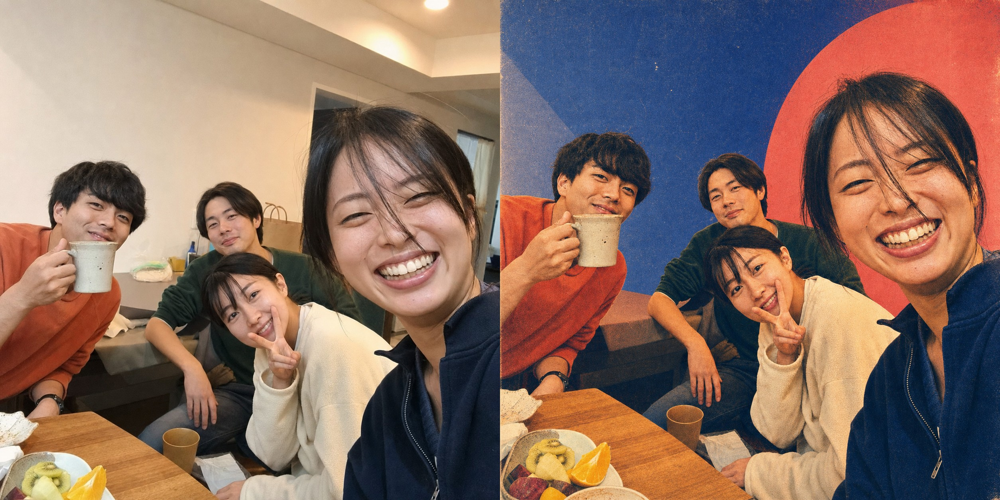

# Retro Print Portrait

**English** · [简体中文](README.zh-CN.md)

Retro Print Portrait is a Codex skill for transforming ordinary portraits and candid group photos into square retro editorial posters with risograph and screen-print texture—while preserving identity, expression, pose, relationships, and the original photographic structure.

The callable skill name is `retro-print-portrait`.


## What Makes It Different

- Preserves identity, facial proportions, expression, gaze, hairstyle, pose, hands, clothing, and camera viewpoint.
- Keeps a photographic foundation instead of turning the subject into a cartoon or generic illustration.
- Protects exact person count, depth order, overlaps, individual gestures, props, and casual asymmetry in group photos.
- Uses risograph grain, screen-print texture, halftone dots, ink bleed, paper fibers, and slight color misregistration.
- Adapts the background palette to each source photo instead of repeating one fixed template.
- Produces a clean 1:1 poster without text, logos, signatures, or watermarks.

## Examples

All people shown below are fictional and AI-generated specifically for demonstrating this skill.

| Cool cobalt / coral | Warm coral / pink | Cream / yellow / cobalt |
| --- | --- | --- |
|  |  |  |

### Candid Group-Photo Validation



Example 4 stress-tests the skill on an intentionally ordinary four-person smartphone snapshot with uneven depth, overlapping bodies, different expressions, a mug, a peace sign, table clutter, and mixed household lighting. The result preserves all four people, their front-to-back relationships, gestures, props, casual crop, and domestic scene anchors while applying the same retro print family.

The examples share one visual family while changing the dominant background and layout according to the original clothing, lighting, and scene.

## Requirements

- Codex or another compatible Skill runtime.
- Image inspection for input analysis and quality review.
- Built-in image generation with image-editing support.

Image-generation quality and identity preservation depend on the model available in the host environment. Always review the generated result before publication.

## Installation

Clone the repository and copy the skill into your personal Codex skills directory:

```bash
git clone https://github.com/valokxyz/retro-print-portrait-skill.git
mkdir -p ~/.codex/skills
cp -R retro-print-portrait-skill/skills/retro-print-portrait ~/.codex/skills/
```

Restart Codex if the skill does not appear immediately.

## Usage

Attach a portrait and invoke:

```text
$retro-print-portrait Process this photo.
```

Add a short art direction without rewriting the full prompt:

```text
$retro-print-portrait Preserve the overhead camera angle. Favor warm yellow and cream, using cobalt only as a small contrasting accent.
```

For a candid group photo:

```text
$retro-print-portrait Process this group photo. Preserve every person, expression, gesture, overlap, prop, and the casual snapshot composition.
```

The skill accepts JPG, PNG, HEIC, and other portrait formats supported by the local image workflow. Source files remain unchanged; HEIC files are converted only as non-destructive working copies when necessary.

## Visual DNA

The palette is a coherent family, not a rigid recipe:

- anchors: deep cobalt, ultramarine, and blue violet;
- secondary fields: soft pink, coral, warm red, and muted orange;
- balancing colors: warm yellow and cream white;
- vivid green: clothing or a restrained accent.

Color area and placement respond to the source photo. The treatment remains photographic, with light color blocking and analog print imperfections.

## Preservation Rules

The skill aggressively preserves:

- real identity and recognizability;
- face shape, features, age, expression, gaze, and head angle;
- hairstyle, glasses, hats, accessories, clothing, pose, and hand gestures;
- the exact number of people and their left-to-right and front-to-back relationships;
- meaningful props, scene anchors, camera viewpoint, and the photographic skeleton.

It avoids beauty filters, face swaps, standardized expressions, distorted hands, missing or duplicated people, studio-style regrouping, cartoon rendering, and fixed background templates.

## Repository Structure

```text
skills/retro-print-portrait/   Installable Codex skill
examples/before/               Fictional AI-generated source portraits
examples/after/                Skill-style results
examples/comparisons/          GitHub-ready before/after sheets
README.md                      Default English documentation
README.zh-CN.md                Simplified Chinese documentation
```

## Privacy

Portraits may contain sensitive personal information. Only process photos you are authorized to use, and review generated results before publishing them. All example assets in this repository depict fictional AI-generated people.

## License

MIT. See [LICENSE](LICENSE).
