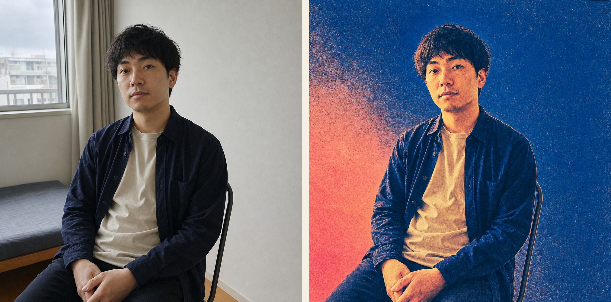
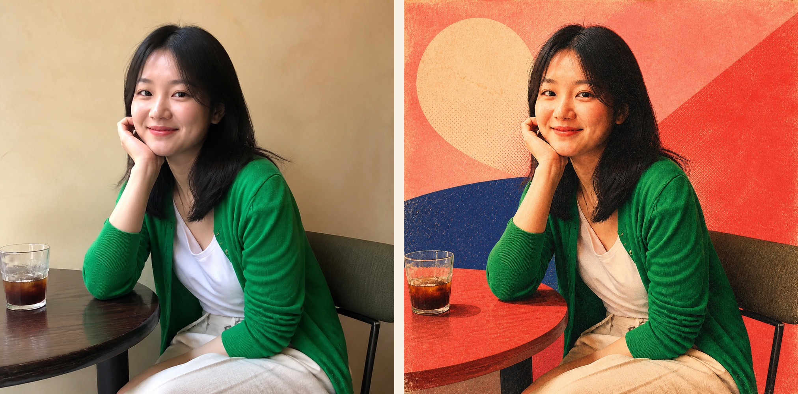
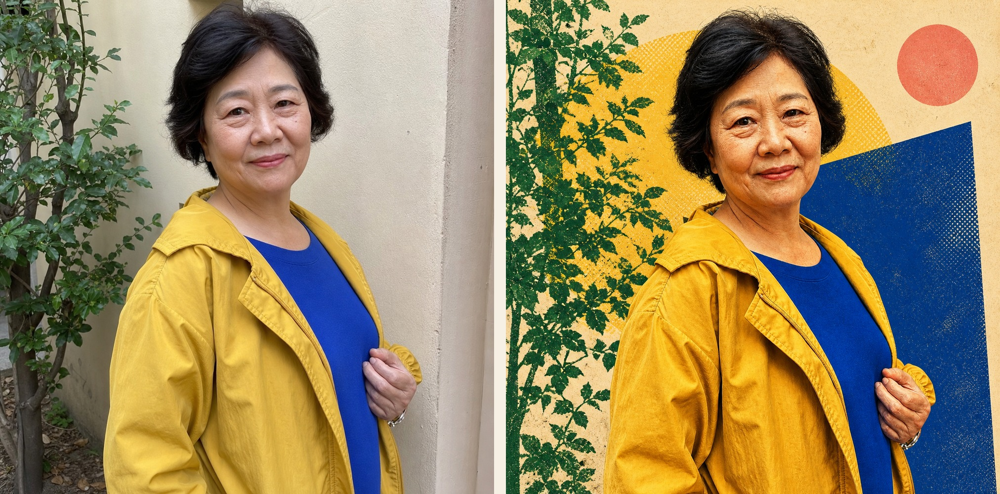

# Retro Print Portrait · 复古印刷肖像

Turn an ordinary portrait into a square retro editorial poster with risograph and screen-print texture—while preserving the person's identity, expression, pose, and photographic composition.

将普通人物照片转成 1:1 复古杂志孔版印刷海报。重点不是“重画一个人”，而是在保留真实人物、表情、姿态和原照片骨架的基础上，进行有颗粒感的艺术印刷处理。



## What makes it different

- Preserves identity, facial proportions, expression, gaze, hairstyle, pose, hands, clothing, and camera viewpoint.
- Keeps a photographic foundation instead of turning the subject into a cartoon or generic illustration.
- Uses risograph grain, screen-print texture, halftone dots, ink bleed, paper fibers, and slight color misregistration.
- Adapts the background palette to each source photo instead of repeating one fixed template.
- Produces a clean 1:1 poster without text, logos, signatures, or watermarks.

## Examples

All people shown below are fictional and AI-generated specifically for demonstrating this skill.

| Cool cobalt / coral | Warm coral / pink | Cream / yellow / cobalt |
|---|---|---|
|  |  |  |

The three results share one visual family while changing the dominant background and layout according to the original clothing, lighting, and scene.

## Install

Clone the repository and copy the skill into your personal Codex skills directory:

```bash
git clone https://github.com/valokxyz/retro-print-portrait-skill.git
mkdir -p ~/.codex/skills
cp -R retro-print-portrait-skill/skills/retro-print-portrait ~/.codex/skills/
```

Restart Codex if the skill does not appear immediately.

## Use

Attach a portrait and invoke:

```text
$retro-print-portrait 处理这张照片
```

You can add a short art direction without rewriting the full prompt:

```text
$retro-print-portrait 保留原来的俯拍角度，背景偏暖黄和奶油白，钴蓝只做小面积对比。
```

The skill accepts JPG, PNG, HEIC, and other portrait formats supported by the local image workflow. Source files are kept unchanged; HEIC files are converted only as non-destructive working copies when necessary.

## Visual DNA

The palette is a coherent family, not a rigid recipe:

- anchors: deep cobalt, ultramarine, blue violet;
- secondary fields: soft pink, coral, warm red, muted orange;
- balancing colors: warm yellow and cream white;
- vivid green: clothing or a restrained accent.

Color area and placement should respond to the source photo. The treatment remains photographic, with light color blocking and analog print imperfections.

## Repository structure

```text
skills/retro-print-portrait/   Installable Codex skill
examples/before/               Fictional AI-generated source portraits
examples/after/                Skill-style results
examples/comparisons/          GitHub-ready before/after sheets
```

## Privacy

Portraits may contain sensitive personal information. Only process photos you are authorized to use, and review generated results before publishing them. The example assets in this repository depict fictional AI-generated people.

## License

MIT. See [LICENSE](LICENSE).

